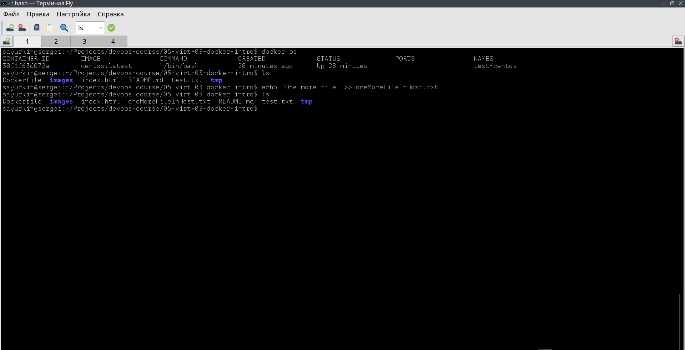

# Задача 1

1. Установлен docker и docker compose на рабочую станцию с использованием инструкции по ссылке: https://wiki.astralinux.ru/pages/viewpage.action?pageId=158601444
Проверка версии docker

Проверка версии docker-compose

1. Создан публичный репозиторий с именем "custom-nginx" на https://hub.docker.com Ссылка на репозиторий: https://hub.docker.com/repository/docker/mkezhman85/custom-nginx/general 

1. Скачан образ nginx:1.21.1 командой `docker pull ginx:1.21.1`

1. Создан [Dockerfile](./Dockerfile)
2. Реализована замена дефолтной индекс-страницы(/usr/share/nginx/html/index.html), на файл index.html с содержимым.

```html
<html>

<head>
    Hey, Netology
</head>

<body>
    <h1>I will be DevOps Engineer!</h1>
</body>

</html>
```

1. Соберите и отправьте созданный образ в свой dockerhub-репозитории c tag 1.0.0 (ТОЛЬКО ЕСЛИ ЕСТЬ ДОСТУП).
Команда для сборки образа

```bash
docker build -t custom-nginx:1.0.0 .
```

Добавление в docker-hub

```bash
docker tag custom-nginx:1.0.0 mkezhman85/custom-nginx:1.0.0
docker push mkezhman85/custom-nginx:1.0.0
```


1. Предоставьте ответ в виде ссылки на https://hub.docker.com/<username_repo>/custom-nginx/general .

Ссылка: https://hub.docker.com/repository/docker/mkezhman85/custom-nginx/general

---

# Задача 2

Запустите ваш образ custom-nginx:1.0.0 командой docker run в соответвии с требованиями:
имя контейнера "ФИО-custom-nginx-t2"
контейнер работает в фоне
контейнер опубликован на порту хост системы 127.0.0.1:8080
```bash
docker run \
    -it \
    -d \
    --name sayurkin-custom-nginx-t2 \
    -p 8080:80 \
    custom-nginx:1.0.0
```
Не удаляя, переименуйте контейнер в "custom-nginx-t2"
```bash
docker rename sayurkin-custom-nginx-t2 custom-nginx-t2
```

Выполните команду date +"%d-%m-%Y %T.%N %Z" ; sleep 0.150 ; docker ps ; ss -tlpn | grep 127.0.0.1:8080  ; docker logs custom-nginx-t2 -n1 ; docker exec -it custom-nginx-t2 base64 /usr/share/nginx/html/index.html

Убедитесь с помощью curl или веб браузера, что индекс-страница доступна.

В качестве ответа приложите скриншоты консоли, где видно все введенные команды и их вывод.

---

# Задача 3

1. Воспользуйтесь docker help или google, чтобы узнать как подключиться к стандартному потоку ввода/вывода/ошибок контейнера "custom-nginx-t2".
https://docs.docker.com/reference/cli/docker/container/attach/
Запустить контаейнер с флагом `-it`
```bash
docker run \
    -it \
    -d \
    --name custom-nginx-t2 \
    -p 8080:81 \
    custom-nginx:1.0.0
```
Переименовать
```bash
docker rename sayurkin-custom-nginx-t2 custom-nginx-t2
```
Подключитесь к контейнеру 
```bash
docker attach custom-nginx-t2
```

Нажмите комбинацию Ctrl-C.
Выполните docker ps -a и объясните своими словами почему контейнер остановился.

> Указанная комбинация клавиш останавливает процесс. В момент нажатия мы были в контейнере
Перезапустите контейнер

Зайдите в интерактивный терминал контейнера "custom-nginx-t2" с оболочкой bash.

Установите любимый текстовый редактор(vim, nano итд) с помощью apt-get.

Отредактируйте файл "/etc/nginx/conf.d/default.conf", заменив порт "listen 80" на "listen 81".

Запомните(!) и выполните команду nginx -s reload, а затем внутри контейнера curl http://127.0.0.1:80 ; curl http://127.0.0.1:81.


Выйдите из контейнера, набрав в консоли exit или Ctrl-D.

Проверьте вывод команд: 
- `ss -tlpn | grep 127.0.0.1:8080` 
- `docker port custom-nginx-t2`
- `curl http://127.0.0.1:8080`. 

Кратко объясните суть возникшей проблемы.
> Был изменен порт сервера в контейнере.

Это дополнительное, необязательное задание. Попробуйте самостоятельно исправить конфигурацию контейнера, используя доступные источники в интернете. Не изменяйте конфигурацию nginx и не удаляйте контейнер. Останавливать контейнер можно. пример источника

Удалите запущенный контейнер "custom-nginx-t2", не останавливая его.(воспользуйтесь --help или google)


---

# Задача 4

Запустите первый контейнер из образа centos c любым тегом в фоновом режиме, подключив папку текущий рабочий каталог $(pwd) на хостовой машине в /data контейнера, используя ключ -v.

```bash
docker run \
    -it \
    -v $(pwd):/data \
    --name test-centos \
    -d \
    centos:latest
```

Запустите второй контейнер из образа debian в фоновом режиме, подключив текущий рабочий каталог $(pwd) в /data контейнера.

```bash
docker run \
    -it \
    -v $(pwd):/data \
    --name test-debian \
    -d \
    debian:latest
```

Подключитесь к первому контейнеру с помощью docker exec и создайте текстовый файл любого содержания в /data.

```bash
docker exec \
    -it \
    test-debian \
    bash -c \
    "echo 'some text' >> /data/test.txt"
```


Добавьте ещё один файл в текущий каталог $(pwd) на хостовой машине.

```bash
echo 'One more file' >> oneMoreFileInHost.txt

```


Подключитесь во второй контейнер и отобразите листинг и содержание файлов в /data контейнера.


---

# Задача 5


Создайте отдельную директорию(например /tmp/netology/docker/task5) и 2 файла внутри него. 
- "compose.yaml"
- "docker-compose.yaml"

Выполните команду `docker compose up -d`

Какой из файлов был запущен и почему? (подсказка: https://docs.docker.com/compose/compose-application-model/#the-compose-file )

```bash
~/Projects/devops-course/05-virt-03-docker-intro/tmp/netology/docker/task5$ docker compose logs
WARN[0000] Found multiple config files with supported names: /home/sayurkin/Projects/devops-course/05-virt-03-docker-intro/tmp/netology/docker/task5/compose.yaml, /home/sayurkin/Projects/devops-course/05-virt-03-docker-intro/tmp/netology/docker/task5/docker-compose.yaml 
WARN[0000] Using /home/sayurkin/Projects/devops-course/05-virt-03-docker-intro/tmp/netology/docker/task5/compose.yaml 
WARN[0000] /home/sayurkin/Projects/devops-course/05-virt-03-docker-intro/tmp/netology/docker/task5/compose.yaml: the attribute `version` is obsolete, it will be ignored, please remove it to avoid potential confusion 

```

Отредактируйте файл compose.yaml так, чтобы были запущенны оба файла. (подсказка: https://docs.docker.com/compose/compose-file/14-include/)

```yaml
version: "3"
include:
  - docker-compose.yaml
services:
  portainer:
    image: portainer/portainer-ce:latest
    network_mode: host
    ports:
      - "9000:9000"
    volumes:
      - /var/run/docker.sock:/var/run/docker.sock
```


Выполните в консоли вашей хостовой ОС необходимые команды чтобы залить образ custom-nginx как custom-nginx:latest в запущенное вами, локальное registry. Дополнительная документация: https://distribution.github.io/distribution/about/deploying/

Откройте страницу "https://127.0.0.1:9000" и произведите начальную настройку portainer.(логин и пароль адмнистратора)


Откройте страницу "http://127.0.0.1:9000/#!/home", выберите ваше local окружение. Перейдите на вкладку "stacks" и в "web editor" задеплойте следующий компоуз:


```yml
version: '3'

services:
  nginx:
    image: 127.0.0.1:5000/custom-nginx
    ports:
      - "9090:80"
```


Перейдите на страницу "http://127.0.0.1:9000/#!/2/docker/containers", выберите контейнер с nginx и нажмите на кнопку "inspect". В представлении <> Tree разверните поле "Config" и сделайте скриншот от поля "AppArmorProfile" до "Driver".


Удалите любой из манифестов компоуза(например compose.yaml). Выполните команду "docker compose up -d". Прочитайте warning, объясните суть предупреждения и выполните предложенное действие. Погасите compose-проект ОДНОЙ(обязательно!!) командой.
> После удаления остались контейнеры, не описанные в манифесте

```bash
docker compose stop
```


