# Задача 0
Убедитесь что у вас НЕ(!) установлен docker-compose, для этого получите следующую ошибку от команды `docker-compose --version`
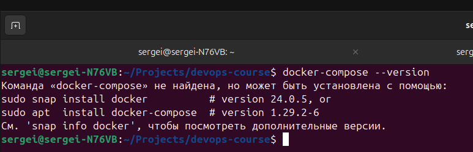

Убедитесь что у вас УСТАНОВЛЕН docker compose(без тире) версии не менее v2.24.X, для это выполните команду `docker compose version`
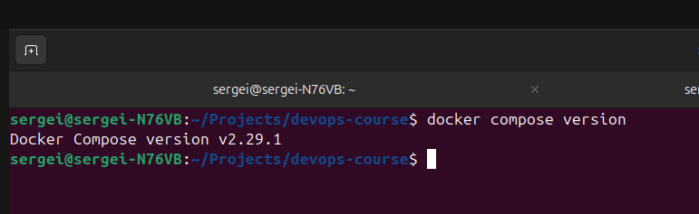

---
# Задача 1

1. Сделайте в своем github пространстве fork репозитория
Ссылка: https://github.com/Mkezhman85/shvirtd-example-python

2. Создайте файл с именем Dockerfile.python для сборки данного проекта
   - [x] (для 3 задания изучите https://docs.docker.com/compose/compose-file/build/ ). 
   
   - [x] Используйте базовый образ python:3.9-slim. 
   ```Dockerfile
   FROM python:3.9-slim
   WORKDIR /app
   COPY . .
   RUN pip install --no-cache-dir -r requirements.txt
   CMD [ "python", "main.py"]
   ```
   - [x] Обязательно используйте конструкцию COPY . . в Dockerfile.

   - [x] Не забудьте исключить ненужные в имадже файлы с помощью dockerignore. 
   ```ini
   /haproxy
   /nginx
   .gitignore
   compose.yaml
   init.sh
   LICENCE
   proxy.yaml
   schema.pdf
   README.md
   .dockerignore
   ```
   - [x] Протестируйте корректность сборки.
  
    ```bash
    docker build -t python_app .
    ```
    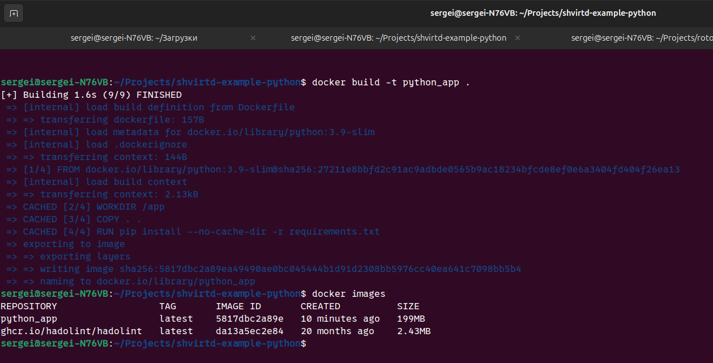

---

# Задача 2

- [x] Создайте в yandex cloud container registry с именем "test" с помощью "yc tool"
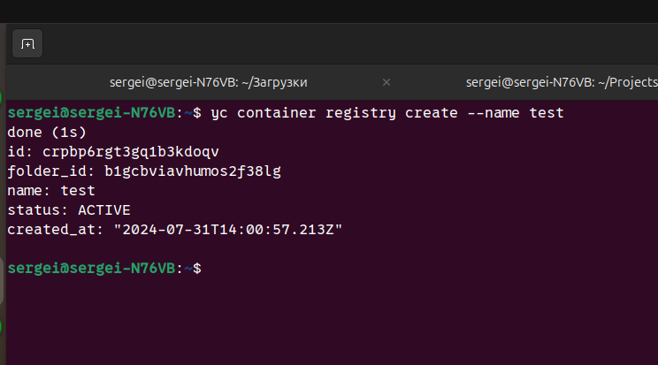
- [x] Настройте аутентификацию вашего локального docker в yandex container registry.
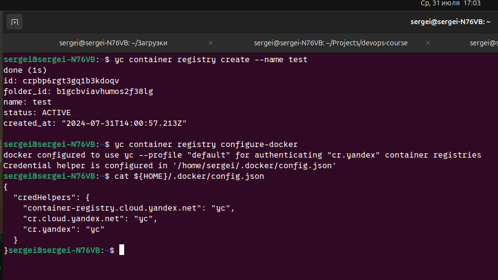
- [x] Соберите и залейте в него образ с python приложением из задания №1.
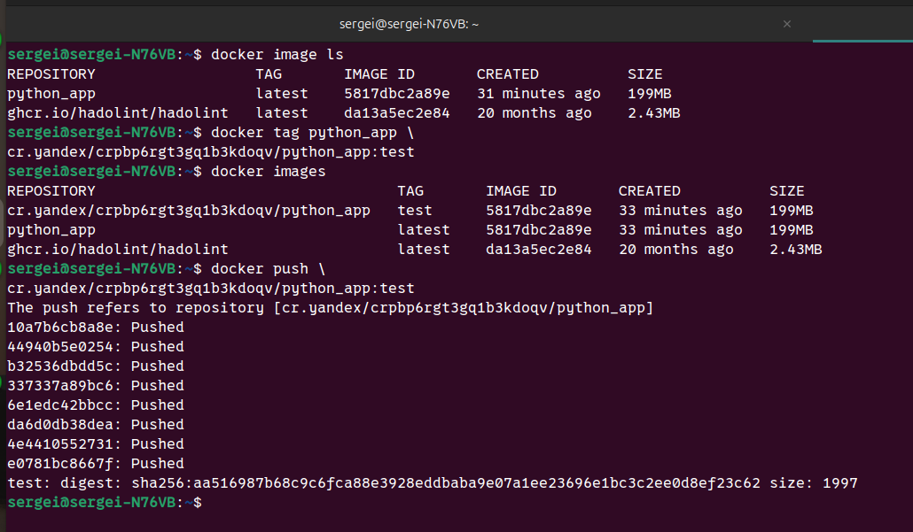
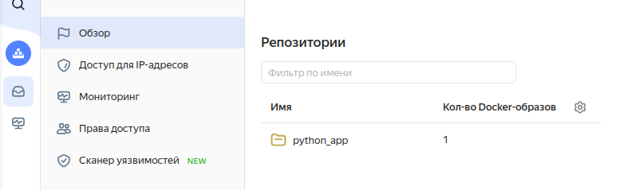
- [x] Просканируйте образ на уязвимости.
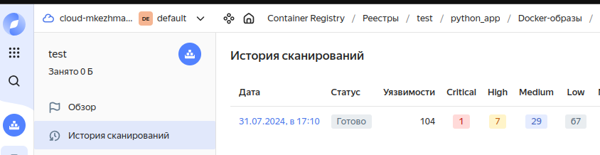
- [x] В качестве ответа приложите отчет сканирования.
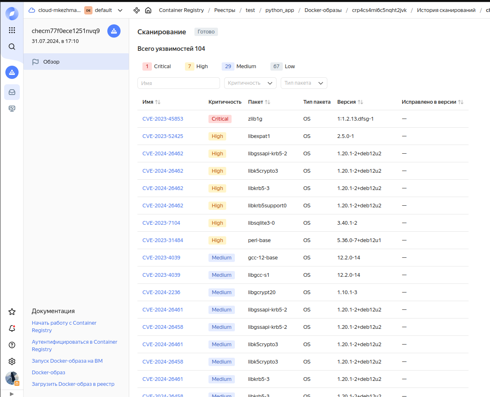

---

# Задача 3

- [x] Изучите файл "proxy.yaml"
Создайте в репозитории с проектом файл compose.yaml. С помощью директивы "include" подключите к нему файл "proxy.yaml".

- [x] Опишите в файле compose.yaml следующие сервисы:
   - web. 
     - Образ приложения должен ИЛИ собираться при запуске compose из файла Dockerfile.python ИЛИ скачиваться из yandex cloud container registry(из задание №2 со *). 
     - Контейнер должен работать в bridge-сети с названием backend и иметь фиксированный ipv4-адрес 172.20.0.5. 
     - Сервис должен всегда перезапускаться в случае ошибок. 
     - Передайте необходимые ENV-переменные для подключения к Mysql базе данных по сетевому имени сервиса web

   - db. image=mysql:8. 
     - Контейнер должен работать в bridge-сети с названием backend и иметь фиксированный ipv4-адрес 172.20.0.10. 
     - Явно перезапуск сервиса в случае ошибок. 
     - Передайте необходимые ENV-переменные для создания: пароля root пользователя, создания базы данных, пользователя и пароля для web-приложения.
     - Обязательно используйте уже существующий .env file для назначения секретных ENV-переменных!

   ```yaml
   version: "3"
   include:
   - proxy.yaml
   services:
   db:
      image: mysql:8
      restart: always    
      networks:
         backend:
         ipv4_address: 172.20.0.10
      env_file:
         - .env
      volumes:
         - ./data:/var/lib/mysql

   web:
      depends_on: ["db"]
      build: .
      restart: always
      networks:
         backend:
         ipv4_address: 172.20.0.5
      environment:
         - DB_HOST=172.20.0.10
         - DB_USER=app
         - DB_PASSWORD=QwErTy1234
         - DB_NAME=virtd
   ```

   > Важно: Значения env переменных сервиса web кавычки не указывать!

- [x] Запустите проект локально с помощью docker compose , добейтесь его стабильной работы: команда curl -L http://127.0.0.1:8090 должна возвращать в качестве ответа время и локальный IP-адрес. Если сервисы не стартуют воспользуйтесь командами: docker ps -a  и docker logs <container_name> . Если вместо IP-адреса вы получаете NULL --убедитесь, что вы шлете запрос на порт 8090, а не 5000.
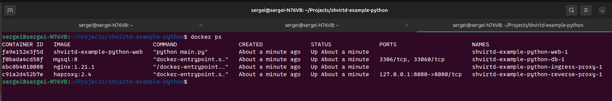
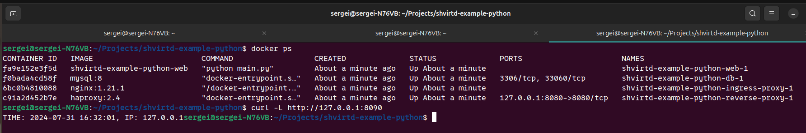
- [x] Подключитесь к БД mysql с помощью команды docker exec <имя_контейнера> mysql -uroot -p<пароль root-пользователя>(обратите внимание что между ключем -u и логином root нет пробела. это важно!!! тоже самое с паролем) . Введите последовательно команды (не забываем в конце символ ; ): show databases; use <имя вашей базы данных(по-умолчанию example)>; show tables; SELECT * from requests LIMIT 10;.
- [x] Остановите проект. В качестве ответа приложите скриншот sql-запроса.
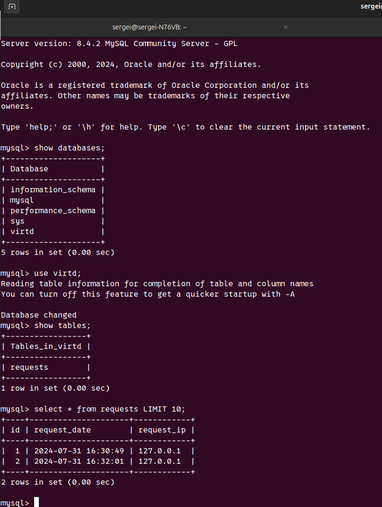

---


# Задача 4
- [x] Запустите в Yandex Cloud ВМ (вам хватит 2 Гб Ram).
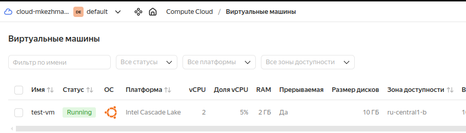
- [x] Подключитесь к Вм по ssh и установите docker.
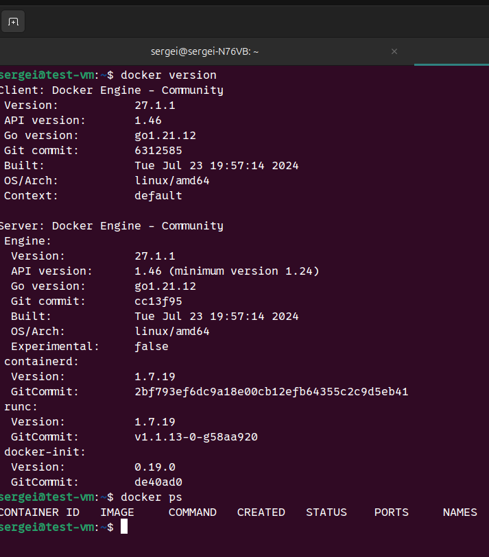
- [x] Напишите bash-скрипт, который скачает ваш fork-репозиторий в каталог /opt и запустит проект целиком.
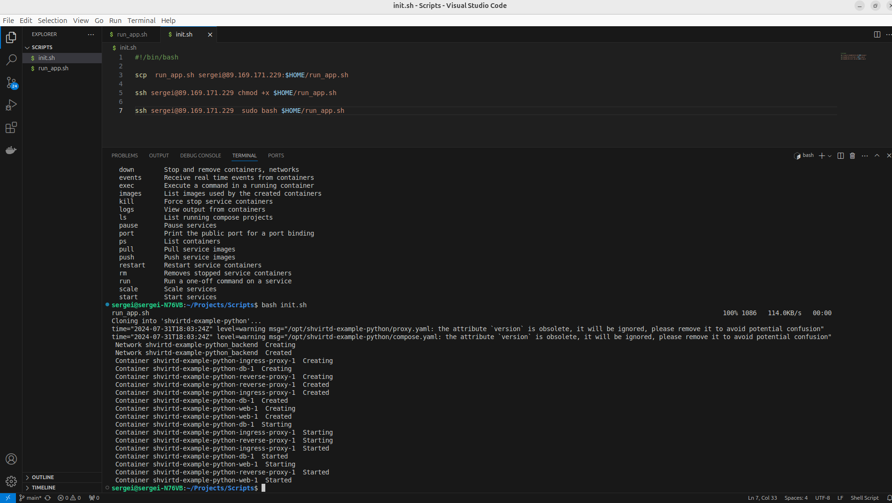

init script

```bash
#!/bin/bash

scp  run_app.sh user@<ip>:$HOME/run_app.sh

ssh user@<ip> chmod +x $HOME/run_app.sh

ssh user@<ip>  sudo bash $HOME/run_app.sh
```

run app script

```bash
#!/bin/bash

cd /opt

git clone https://github.com/netology-code/shvirtd-example-python.git

cd shvirtd-example-python

cat << EOF > .dockerignore
/haproxy
/nginx
.gitignore
compose.yaml
init.sh
LICENCE
proxy.yaml
schema.pdf
README.md
.dockerignore
EOF

cat << EOF > .dockerignore

EOF

cat << EOF > .env
MYSQL_ROOT_PASSWORD="YtReWq4321"

MYSQL_DATABASE="virtd"
MYSQL_USER="app"
MYSQL_PASSWORD="QwErTy1234"
EOF

cat << EOF > Dockerfile
FROM python:3.9-slim
WORKDIR /app
COPY . .
RUN pip install --no-cache-dir -r requirements.txt
CMD [ "python", "main.py"]
EOF

cat << EOF > compose.yaml
version: "3"
include:
  - proxy.yaml
services:
  db:
    image: mysql:8
    restart: always    
    networks:
      backend:
        ipv4_address: 172.20.0.10
    env_file:
      - .env
    volumes:
      - ./data:/var/lib/mysql

  web:
    depends_on: ["db"]
    build: .
    restart: always
    networks:
      backend:
        ipv4_address: 172.20.0.5
    environment:
      - DB_HOST=172.20.0.10
      - DB_USER=app
      - DB_PASSWORD=QwErTy1234
      - DB_NAME=virtd
EOF

docker compose up -d
```

- [x] Зайдите на сайт проверки http подключений, например(или аналогичный): https://check-host.net/check-http и запустите проверку вашего сервиса http://<внешний_IP-адрес_вашей_ВМ>:8090. Таким образом трафик будет направлен в ingress-proxy. ПРИМЕЧАНИЕ: Приложение весьма вероятно упадет под нагрузкой, но успеет обработать часть запросов - этого достаточно.
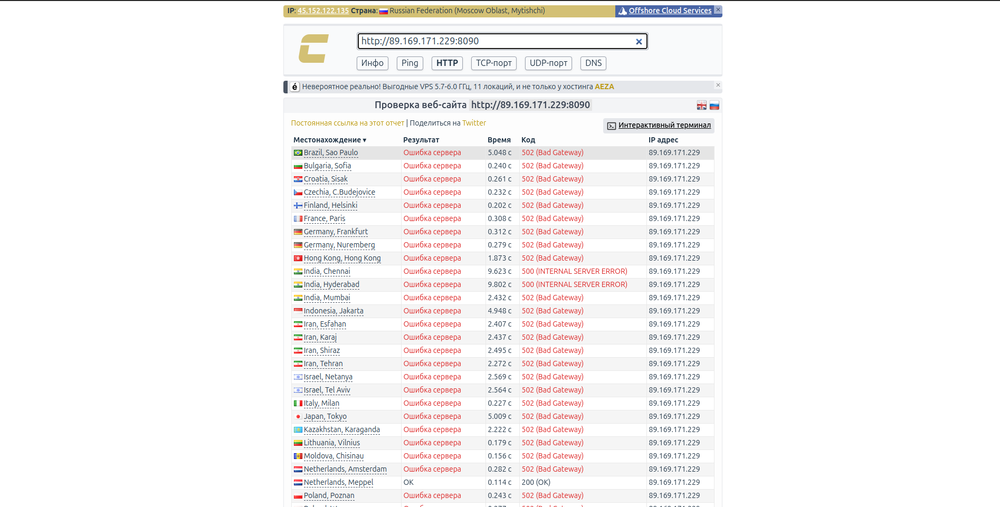

- [x] (Необязательная часть) Дополнительно настройте remote ssh context к вашему серверу. Отобразите список контекстов и результат удаленного выполнения docker ps -a
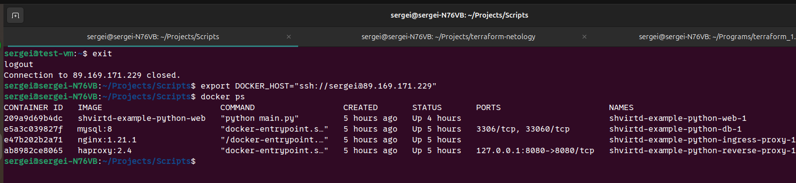

- [ ] В качестве ответа повторите sql-запрос и приложите скриншот с данного сервера, bash-скрипт и ссылку на fork-репозиторий.
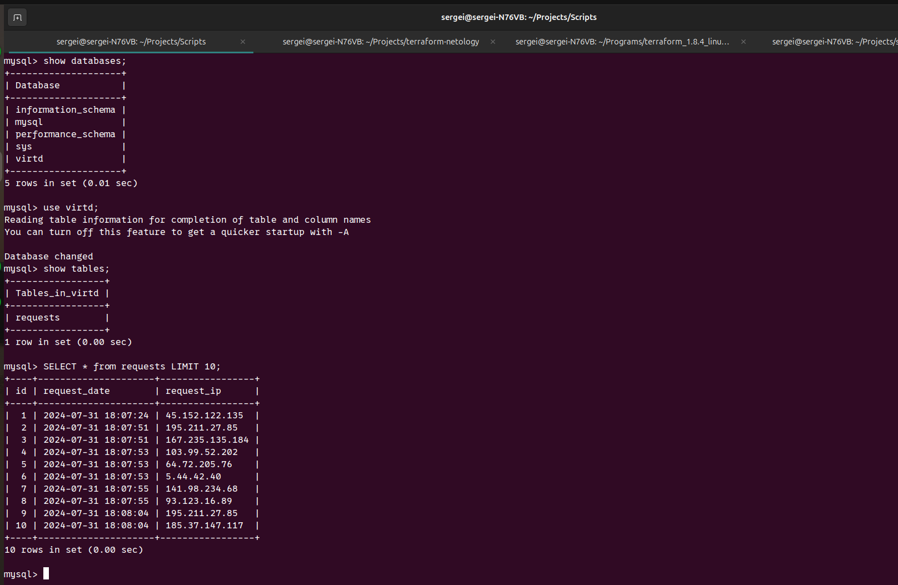
