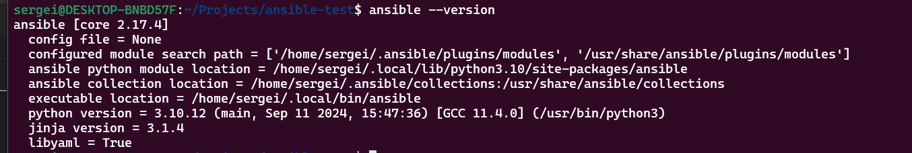
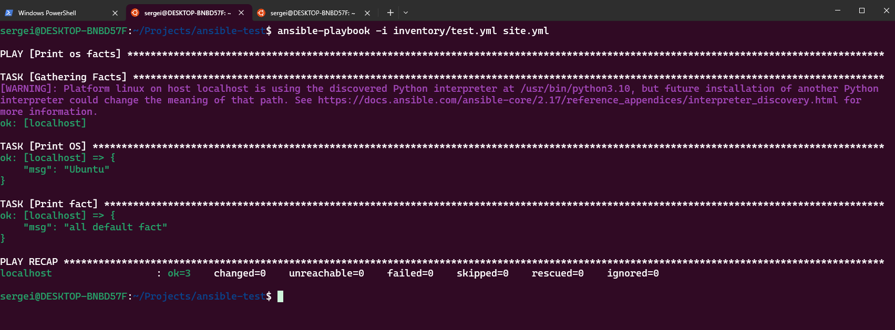
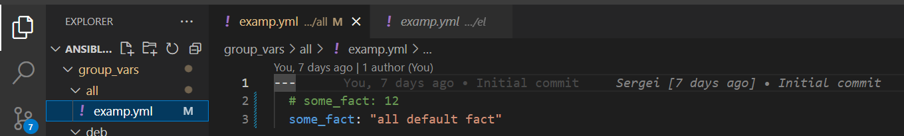

# Домашнее задание к занятию 1 «Введение в Ansible»

## Подготовка к выполнению

1. Установите Ansible версии 2.10 или выше.

2. Создайте свой публичный репозиторий на GitHub с произвольным именем.
https://github.com/Mkezhman85/ansible-test
3. Скачайте [Playbook](./playbook/) из репозитория с домашним заданием и перенесите его в свой репозиторий.
https://github.com/Mkezhman85/ansible-test

## Основная часть

1. Попробуйте запустить playbook на окружении из `test.yml`, зафиксируйте значение, которое имеет факт `some_fact` для указанного хоста при выполнении playbook.
```bash
ansible-playbook -i inventory/test.yml site.yml 
```

2. Найдите файл с переменными (group_vars), в котором задаётся найденное в первом пункте значение, и поменяйте его на `all default fact`.


3. Воспользуйтесь подготовленным (используется `docker`) или создайте собственное окружение для проведения дальнейших испытаний.

`docker run --rm --name "ubuntu" -d matthewfeickert/docker-python3-ubuntu sleep 6000`
`docker run --rm --name "centos7" -d centos/python-38-centos7 sleep 6000`
`docker ps`
```bash
sergei@DESKTOP-BNBD57F:~/Projects/ansible-test$ docker ps
CONTAINER ID   IMAGE                                   COMMAND                  CREATED              STATUS              PORTS      NAMES
308a598d88a0   matthewfeickert/docker-python3-ubuntu   "sleep 6000"             About a minute ago   Up About a minute              ubuntu
a6cc13fefc70   centos/python-38-centos7                "container-entrypoin…"   5 minutes ago        Up 5 minutes        8080/tcp   centos7
```

4. Проведите запуск playbook на окружении из `prod.yml`. Зафиксируйте полученные значения `some_fact` для каждого из `managed host`.
```bash
sergei@DESKTOP-BNBD57F:~/Projects/ansible-test$ ansible-playbook -i inventory/prod.yml site.yml 

PLAY [Print os facts] ****************************************************************************************************************************************

TASK [Gathering Facts] ***************************************************************************************************************************************
ok: [ubuntu]
ok: [centos7]

TASK [Print OS] **********************************************************************************************************************************************
ok: [centos7] => {
    "msg": "CentOS"
}
ok: [ubuntu] => {
    "msg": "Ubuntu"
}

TASK [Print fact] ********************************************************************************************************************************************
ok: [centos7] => {
    "msg": "el"
}
ok: [ubuntu] => {
    "msg": "deb"
}

PLAY RECAP ***************************************************************************************************************************************************
centos7                    : ok=3    changed=0    unreachable=0    failed=0    skipped=0    rescued=0    ignored=0   
ubuntu                     : ok=3    changed=0    unreachable=0    failed=0    skipped=0    rescued=0    ignored=0   
```


5. Добавьте факты в `group_vars` каждой из групп хостов так, чтобы для `some_fact` получились значения: для `deb` — `deb default fact`, для `el` — `el default fact`.

6.  Повторите запуск playbook на окружении `prod.yml`. Убедитесь, что выдаются корректные значения для всех хостов.

```bash
sergei@DESKTOP-BNBD57F:~/Projects/ansible-test$ ansible-playbook -i inventory/prod.yml site.yml 

PLAY [Print os facts] ****************************************************************************************************************************************

TASK [Gathering Facts] ***************************************************************************************************************************************
ok: [ubuntu]
ok: [centos7]

TASK [Print OS] **********************************************************************************************************************************************
ok: [centos7] => {
    "msg": "CentOS"
}
ok: [ubuntu] => {
    "msg": "Ubuntu"
}

TASK [Print fact] ********************************************************************************************************************************************
ok: [centos7] => {
    "msg": "el default fact"
}
ok: [ubuntu] => {
    "msg": "deb default fact"
}

PLAY RECAP ***************************************************************************************************************************************************
centos7                    : ok=3    changed=0    unreachable=0    failed=0    skipped=0    rescued=0    ignored=0   
ubuntu                     : ok=3    changed=0    unreachable=0    failed=0    skipped=0    rescued=0    ignored=0 
```

7. При помощи `ansible-vault` зашифруйте факты в `group_vars/deb` и `group_vars/el` с паролем `netology`.
```bash
sergei@DESKTOP-BNBD57F:~/Projects/ansible-test$ ansible-vault encrypt group_vars/deb/examp.yml group_vars/el/examp.yml 
New Vault password: 
Confirm New Vault password: 
Encryption successful
```

8. Запустите playbook на окружении `prod.yml`. При запуске `ansible` должен запросить у вас пароль. Убедитесь в работоспособности.
```bash
sergei@DESKTOP-BNBD57F:~/Projects/ansible-test$ ansible-playbook -i inventory/prod.yml site.yml --ask-vault-pass
Vault password: 

PLAY [Print os facts] ***********************************************************************

TASK [Gathering Facts] **********************************************************************
ok: [ubuntu]
ok: [centos7]

TASK [Print OS] *****************************************************************************
ok: [centos7] => {
    "msg": "CentOS"
}
ok: [ubuntu] => {
    "msg": "Ubuntu"
}

TASK [Print fact] ***************************************************************************
ok: [centos7] => {
    "msg": "el default fact"
}
ok: [ubuntu] => {
    "msg": "deb default fact"
}

PLAY RECAP **********************************************************************************
centos7                    : ok=3    changed=0    unreachable=0    failed=0    skipped=0    rescued=0    ignored=0   
ubuntu                     : ok=3    changed=0    unreachable=0    failed=0    skipped=0    rescued=0    ignored=0   
```

9. Посмотрите при помощи `ansible-doc` список плагинов для подключения. Выберите подходящий для работы на `control node`.

10. В `prod.yml` добавьте новую группу хостов с именем  `local`, в ней разместите localhost с необходимым типом подключения.

11. Запустите playbook на окружении `prod.yml`. При запуске `ansible` должен запросить у вас пароль. Убедитесь, что факты `some_fact` для каждого из хостов определены из верных `group_vars`.
```bash
sergei@DESKTOP-BNBD57F:~/Projects/ansible-test$ ansible-playbook -i inventory/prod.yml site.yml --ask-vault-pass
Vault password: 

PLAY [Print os facts] *****************************************************************************************************************************************************

TASK [Gathering Facts] ****************************************************************************************************************************************************
ok: [ubuntu]
ok: [centos7]
ok: [localhost]

TASK [Print OS] ***********************************************************************************************************************************************************
ok: [centos7] => {
    "msg": "CentOS"
}
ok: [ubuntu] => {
    "msg": "Ubuntu"
}
ok: [localhost] => {
    "msg": "Ubuntu"
}

TASK [Print fact] *********************************************************************************************************************************************************
ok: [centos7] => {
    "msg": "el default fact"
}
ok: [ubuntu] => {
    "msg": "deb default fact"
}
ok: [localhost] => {
    "msg": "all default fact"
}

PLAY RECAP ****************************************************************************************************************************************************************
centos7                    : ok=3    changed=0    unreachable=0    failed=0    skipped=0    rescued=0    ignored=0   
localhost                  : ok=3    changed=0    unreachable=0    failed=0    skipped=0    rescued=0    ignored=0   
ubuntu                     : ok=3    changed=0    unreachable=0    failed=0    skipped=0    rescued=0    ignored=0 
```
12. Заполните `README.md` ответами на вопросы. Сделайте `git push` в ветку `master`. В ответе отправьте ссылку на ваш открытый репозиторий с изменённым `playbook` и заполненным `README.md`.

13. Предоставьте скриншоты результатов запуска команд.


