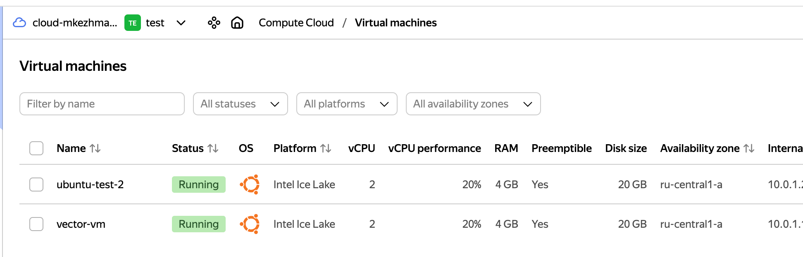

# Домашнее задание к занятию 2 «Работа с Playbook»

## Подготовка к выполнению

1. * Необязательно. Изучите, что такое [ClickHouse](https://www.youtube.com/watch?v=fjTNS2zkeBs) и [Vector](https://www.youtube.com/watch?v=CgEhyffisLY).
2. Создайте свой публичный репозиторий на GitHub с произвольным именем или используйте старый.
https://github.com/Mkezhman85/ansible-test/tree/main
3. Скачайте [Playbook](./playbook/) из репозитория с домашним заданием и перенесите его в свой репозиторий.
https://github.com/Mkezhman85/ansible-test/tree/main/08-ansible-02-playbook/playbook
4. Подготовьте хосты в соответствии с группами из предподготовленного playbook.

## Основная часть

1. Подготовьте свой inventory-файл `prod.yml`.
```yml
---
clickhouse:
  hosts:
    clickhouse-01:
      ansible_host: 51.250.86.153
      ansible_user: sergei
      ansible_connection: ssh
      ansible_ssh_common_args: '-o StrictHostKeyChecking=no'
vector:
  hosts:
    vector-1:
      ansible_host: 51.250.71.131
      ansible_user: sergei
      ansible_connection: ssh
      ansible_ssh_common_args: '-o StrictHostKeyChecking=no'
```
2. Допишите playbook: нужно сделать ещё один play, который устанавливает и настраивает [vector](https://vector.dev). Конфигурация vector должна деплоиться через template файл jinja2. От вас не требуется использовать все возможности шаблонизатора, просто вставьте стандартный конфиг в template файл. Информация по шаблонам по [ссылке](https://www.dmosk.ru/instruktions.php?object=ansible-nginx-install). не забудьте сделать handler на перезапуск vector в случае изменения конфигурации!
https://github.com/Mkezhman85/ansible-test/blob/main/08-ansible-02-playbook/playbook/site.yml
3. При создании tasks рекомендую использовать модули: `get_url`, `template`, `unarchive`, `file`.
4. Tasks должны: скачать дистрибутив нужной версии, выполнить распаковку в выбранную директорию, установить vector.
```bash
sergei@vector-vm:~$ vector --version
vector 0.30.0 (x86_64-unknown-linux-gnu 38c3f0b 2023-05-22 17:38:48.655488673)
```
5. Запустите `ansible-lint site.yml` и исправьте ошибки, если они есть.
```bash
sergei@MacBook-Pro-Sergei playbook % ansible-lint site.yml 
WARNING  Listing 1 violation(s) that are fatal
jinja[spacing]: Jinja2 spacing could be improved: create_db.rc != 0 and create_db.rc !=82 -> create_db.rc != 0 and create_db.rc != 82 (warning)
site.yml:44 Jinja2 template rewrite recommendation: `create_db.rc != 0 and create_db.rc != 82`.

Read documentation for instructions on how to ignore specific rule violations.

              Rule Violation Summary               
 count tag            profile rule associated tags 
     1 jinja[spacing] basic   formatting (warning) 

Passed: 0 failure(s), 1 warning(s) on 1 files. Last profile that met the validation criteria was 'min'.
A new release of ansible-lint is available: 6.22.2 → 24.9.2
sergei@MacBook-Pro-Sergei playbook % 
```
6. Попробуйте запустить playbook на этом окружении с флагом `--check`.
```bash
sergei@MacBook-Pro-Sergei playbook % ansible-playbook -i inventory/prod.yml site.yml --check

PLAY [Install Clickhouse] ***********************************************************************************************************************************

TASK [Gathering Facts] **************************************************************************************************************************************
ok: [clickhouse-01]

TASK [Get clickhouse distrib] *******************************************************************************************************************************
ok: [clickhouse-01] => (item=clickhouse-common-static)
ok: [clickhouse-01] => (item=clickhouse-client)
ok: [clickhouse-01] => (item=clickhouse-server)

TASK [Install a .deb packages] ******************************************************************************************************************************
ok: [clickhouse-01] => (item=clickhouse-common-static)
ok: [clickhouse-01] => (item=clickhouse-client)
ok: [clickhouse-01] => (item=clickhouse-server)

TASK [Flush handlers] ***************************************************************************************************************************************

TASK [Pause 20 sec] *****************************************************************************************************************************************
Pausing for 20 seconds
(ctrl+C then 'C' = continue early, ctrl+C then 'A' = abort)
ok: [clickhouse-01]

TASK [Create database] **************************************************************************************************************************************
skipping: [clickhouse-01]

PLAY [Install vector] ***************************************************************************************************************************************

TASK [Gathering Facts] **************************************************************************************************************************************
ok: [vector-1]

TASK [Get vector distrib] ***********************************************************************************************************************************
ok: [vector-1]

TASK [Install vector packages] ******************************************************************************************************************************
ok: [vector-1] => (item=[0, 'vector-0.30.0.deb'])

TASK [Flush handlers to restart vector] *********************************************************************************************************************

TASK [Configure Vector | ensure what directory exists] ******************************************************************************************************
ok: [vector-1]

TASK [Configure Vector | Template config] *******************************************************************************************************************
ok: [vector-1]

PLAY RECAP **************************************************************************************************************************************************
clickhouse-01              : ok=4    changed=0    unreachable=0    failed=0    skipped=1    rescued=0    ignored=0   
vector-1                   : ok=5    changed=0    unreachable=0    failed=0    skipped=0    rescued=0    ignored=0  
```
7. Запустите playbook на `prod.yml` окружении с флагом `--diff`. Убедитесь, что изменения на системе произведены.
```bash
sergei@MacBook-Pro-Sergei playbook % ansible-playbook -i inventory/prod.yml site.yml --diff 

PLAY [Install Clickhouse] ***********************************************************************************************************************************

TASK [Gathering Facts] **************************************************************************************************************************************
ok: [clickhouse-01]

TASK [Get clickhouse distrib] *******************************************************************************************************************************
ok: [clickhouse-01] => (item=clickhouse-common-static)
ok: [clickhouse-01] => (item=clickhouse-client)
ok: [clickhouse-01] => (item=clickhouse-server)

TASK [Install a .deb packages] ******************************************************************************************************************************
ok: [clickhouse-01] => (item=clickhouse-common-static)
ok: [clickhouse-01] => (item=clickhouse-client)
ok: [clickhouse-01] => (item=clickhouse-server)

TASK [Flush handlers] ***************************************************************************************************************************************

TASK [Pause 20 sec] *****************************************************************************************************************************************
Pausing for 20 seconds
(ctrl+C then 'C' = continue early, ctrl+C then 'A' = abort)
ok: [clickhouse-01]

TASK [Create database] **************************************************************************************************************************************
ok: [clickhouse-01]

PLAY [Install vector] ***************************************************************************************************************************************

TASK [Gathering Facts] **************************************************************************************************************************************
ok: [vector-1]

TASK [Get vector distrib] ***********************************************************************************************************************************
ok: [vector-1]

TASK [Install vector packages] ******************************************************************************************************************************
ok: [vector-1] => (item=[0, 'vector-0.30.0.deb'])

TASK [Flush handlers to restart vector] *********************************************************************************************************************

TASK [Configure Vector | ensure what directory exists] ******************************************************************************************************
ok: [vector-1]

TASK [Configure Vector | Template config] *******************************************************************************************************************
ok: [vector-1]

PLAY RECAP **************************************************************************************************************************************************
clickhouse-01              : ok=5    changed=0    unreachable=0    failed=0    skipped=0    rescued=0    ignored=0   
vector-1                   : ok=5    changed=0    unreachable=0    failed=0    skipped=0    rescued=0    ignored=0   
```
8. Повторно запустите playbook с флагом `--diff` и убедитесь, что playbook идемпотентен.
```bash
sergei@MacBook-Pro-Sergei playbook % ansible-playbook -i inventory/prod.yml site.yml --diff

PLAY [Install Clickhouse] ***********************************************************************************************************************************

TASK [Gathering Facts] **************************************************************************************************************************************
ok: [clickhouse-01]

TASK [Get clickhouse distrib] *******************************************************************************************************************************
ok: [clickhouse-01] => (item=clickhouse-common-static)
ok: [clickhouse-01] => (item=clickhouse-client)
ok: [clickhouse-01] => (item=clickhouse-server)

TASK [Install a .deb packages] ******************************************************************************************************************************
ok: [clickhouse-01] => (item=clickhouse-common-static)
ok: [clickhouse-01] => (item=clickhouse-client)
ok: [clickhouse-01] => (item=clickhouse-server)

TASK [Flush handlers] ***************************************************************************************************************************************

TASK [Pause 20 sec] *****************************************************************************************************************************************
Pausing for 20 seconds
(ctrl+C then 'C' = continue early, ctrl+C then 'A' = abort)
ok: [clickhouse-01]

TASK [Create database] **************************************************************************************************************************************
ok: [clickhouse-01]

PLAY [Install vector] ***************************************************************************************************************************************

TASK [Gathering Facts] **************************************************************************************************************************************
ok: [vector-1]

TASK [Get vector distrib] ***********************************************************************************************************************************
ok: [vector-1]

TASK [Install vector packages] ******************************************************************************************************************************
ok: [vector-1] => (item=[0, 'vector-0.30.0.deb'])

TASK [Flush handlers to restart vector] *********************************************************************************************************************

TASK [Configure Vector | ensure what directory exists] ******************************************************************************************************
ok: [vector-1]

TASK [Configure Vector | Template config] *******************************************************************************************************************
ok: [vector-1]

PLAY RECAP **************************************************************************************************************************************************
clickhouse-01              : ok=5    changed=0    unreachable=0    failed=0    skipped=0    rescued=0    ignored=0   
vector-1                   : ok=5    changed=0    unreachable=0    failed=0    skipped=0    rescued=0    ignored=0   
```
---
