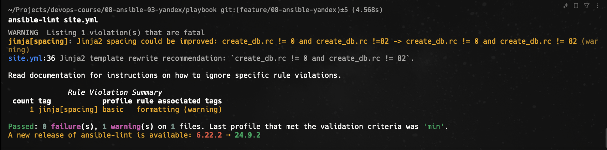

# Домашнее задание к занятию 3 «Использование Ansible»

## Подготовка к выполнению

1. Подготовьте в Yandex Cloud три хоста: для `clickhouse`, для `vector` и для `lighthouse`.
[Создание виртуальных машин с помощью terraform](./terraform-vms-create/main.tf)
2. Репозиторий LightHouse находится [по ссылке](https://github.com/VKCOM/lighthouse).

## Основная часть
1. Допишите playbook: нужно сделать ещё один play, который устанавливает и настраивает LightHouse.
[Ссылка на play](./playbook/site.yml)
2. При создании tasks рекомендую использовать модули: `get_url`, `template`, `yum`, `apt`.
3. Tasks должны: скачать статику LightHouse, установить Nginx или любой другой веб-сервер, настроить его конфиг для открытия LightHouse, запустить веб-сервер.s
> Скачал nginx через apt и настроил конфигурацию
4. Подготовьте свой inventory-файл `prod.yml`.
[Ссылка на inventory](./playbook/inventory/prod.yml)
5. Запустите `ansible-lint site.yml` и исправьте ошибки, если они есть.

6. Попробуйте запустить playbook на этом окружении с флагом `--check`.
```bash
ansible-playbook -i inventory/prod.yml site.yml --check

PLAY [Install Clickhouse] ****************************************************************************************************************

TASK [Gathering Facts] *******************************************************************************************************************
ok: [clickhouse-01]

TASK [Get clickhouse distrib] ************************************************************************************************************
ok: [clickhouse-01] => (item=clickhouse-common-static)
ok: [clickhouse-01] => (item=clickhouse-client)
ok: [clickhouse-01] => (item=clickhouse-server)

TASK [Install a .deb packages] ***********************************************************************************************************
ok: [clickhouse-01] => (item=clickhouse-common-static)
ok: [clickhouse-01] => (item=clickhouse-client)
ok: [clickhouse-01] => (item=clickhouse-server)

TASK [Flush handlers] ********************************************************************************************************************

TASK [Pause 20 sec] **********************************************************************************************************************
Pausing for 20 seconds
(ctrl+C then 'C' = continue early, ctrl+C then 'A' = abort)
ok: [clickhouse-01]

TASK [Create database] *******************************************************************************************************************
skipping: [clickhouse-01]

PLAY [Install vector] ********************************************************************************************************************

TASK [Gathering Facts] *******************************************************************************************************************
ok: [vector-1]

TASK [Get vector distrib] ****************************************************************************************************************
ok: [vector-1]

TASK [Install vector packages] ***********************************************************************************************************
ok: [vector-1] => (item=[0, 'vector-0.30.0.deb'])

TASK [Flush handlers to restart vector] **************************************************************************************************

TASK [Configure Vector | ensure what directory exists] ***********************************************************************************
ok: [vector-1]

TASK [Configure Vector | Template config] ************************************************************************************************
ok: [vector-1]

PLAY [Install lighthouse] ****************************************************************************************************************

TASK [Gathering Facts] *******************************************************************************************************************
ok: [lighthouse-1]

TASK [Install NGINX] *********************************************************************************************************************
ok: [lighthouse-1]

TASK [Setting for nginx] *****************************************************************************************************************
skipping: [lighthouse-1]

TASK [Check nginx] ***********************************************************************************************************************
skipping: [lighthouse-1]

TASK [Check nginx auto enabled] **********************************************************************************************************
skipping: [lighthouse-1]

TASK [Install git] ***********************************************************************************************************************
ok: [lighthouse-1]

TASK [Create lighhouse directory] ********************************************************************************************************
ok: [lighthouse-1]

TASK [Clone lighthouse repository] *******************************************************************************************************
ok: [lighthouse-1]

TASK [Copy ./lighthouse.conf] ************************************************************************************************************
changed: [lighthouse-1]

TASK [Create link in sites-enabled directory] ********************************************************************************************
skipping: [lighthouse-1]

TASK [Testing configuration] *************************************************************************************************************
skipping: [lighthouse-1]

TASK [Remove default configuration] ******************************************************************************************************
ok: [lighthouse-1]

TASK [Reload web server] *****************************************************************************************************************
skipping: [lighthouse-1]

PLAY RECAP *******************************************************************************************************************************
clickhouse-01              : ok=4    changed=0    unreachable=0    failed=0    skipped=1    rescued=0    ignored=0
lighthouse-1               : ok=7    changed=1    unreachable=0    failed=0    skipped=6    rescued=0    ignored=0
vector-1                   : ok=5    changed=0    unreachable=0    failed=0    skipped=0    rescued=0    ignored=0
```
7. Запустите playbook на `prod.yml` окружении с флагом `--diff`. Убедитесь, что изменения на системе произведены.
8. Повторно запустите playbook с флагом `--diff` и убедитесь, что playbook идемпотентен.
```bash
ansible-playbook -i inventory/prod.yml site.yml --diff

PLAY [Install Clickhouse] ****************************************************************************************************************

TASK [Gathering Facts] *******************************************************************************************************************
ok: [clickhouse-01]

TASK [Get clickhouse distrib] ************************************************************************************************************
ok: [clickhouse-01] => (item=clickhouse-common-static)
ok: [clickhouse-01] => (item=clickhouse-client)
ok: [clickhouse-01] => (item=clickhouse-server)

TASK [Install a .deb packages] ***********************************************************************************************************
ok: [clickhouse-01] => (item=clickhouse-common-static)
ok: [clickhouse-01] => (item=clickhouse-client)
ok: [clickhouse-01] => (item=clickhouse-server)

TASK [Flush handlers] ********************************************************************************************************************

TASK [Pause 20 sec] **********************************************************************************************************************
Pausing for 20 seconds
(ctrl+C then 'C' = continue early, ctrl+C then 'A' = abort)
ok: [clickhouse-01]

TASK [Create database] *******************************************************************************************************************
ok: [clickhouse-01]

PLAY [Install vector] ********************************************************************************************************************

TASK [Gathering Facts] *******************************************************************************************************************
ok: [vector-1]

TASK [Get vector distrib] ****************************************************************************************************************
ok: [vector-1]

TASK [Install vector packages] ***********************************************************************************************************
ok: [vector-1] => (item=[0, 'vector-0.30.0.deb'])

TASK [Flush handlers to restart vector] **************************************************************************************************

TASK [Configure Vector | ensure what directory exists] ***********************************************************************************
ok: [vector-1]

TASK [Configure Vector | Template config] ************************************************************************************************
ok: [vector-1]

PLAY [Install lighthouse] ****************************************************************************************************************

TASK [Gathering Facts] *******************************************************************************************************************
ok: [lighthouse-1]

TASK [Install NGINX] *********************************************************************************************************************
ok: [lighthouse-1]

TASK [Setting for nginx] *****************************************************************************************************************
ok: [lighthouse-1]

TASK [Check nginx] ***********************************************************************************************************************
ok: [lighthouse-1]

TASK [Check nginx auto enabled] **********************************************************************************************************
ok: [lighthouse-1]

TASK [Install git] ***********************************************************************************************************************
ok: [lighthouse-1]

TASK [Create lighhouse directory] ********************************************************************************************************
ok: [lighthouse-1]

TASK [Clone lighthouse repository] *******************************************************************************************************
ok: [lighthouse-1]

TASK [Copy ./lighthouse.conf] ************************************************************************************************************
ok: [lighthouse-1]

TASK [Register file exist] ***************************************************************************************************************
ok: [lighthouse-1]

TASK [Create link in sites-enabled directory] ********************************************************************************************
skipping: [lighthouse-1]

TASK [Testing configuration] *************************************************************************************************************
ok: [lighthouse-1]

TASK [Remove default configuration] ******************************************************************************************************
ok: [lighthouse-1]

TASK [Reload web server] *****************************************************************************************************************
ok: [lighthouse-1]

PLAY RECAP *******************************************************************************************************************************
clickhouse-01              : ok=5    changed=0    unreachable=0    failed=0    skipped=0    rescued=0    ignored=0
lighthouse-1               : ok=13   changed=0    unreachable=0    failed=0    skipped=1    rescued=0    ignored=0
vector-1                   : ok=5    changed=0    unreachable=0    failed=0    skipped=0    rescued=0    ignored=0
```
9. Подготовьте README.md-файл по своему playbook. В нём должно быть описано: что делает playbook, какие у него есть параметры и теги.
10. Готовый playbook выложите в свой репозиторий, поставьте тег `08-ansible-03-yandex` на фиксирующий коммит, в ответ предоставьте ссылку на него.

---

### Как оформить решение задания

Выполненное домашнее задание пришлите в виде ссылки на .md-файл в вашем репозитории.