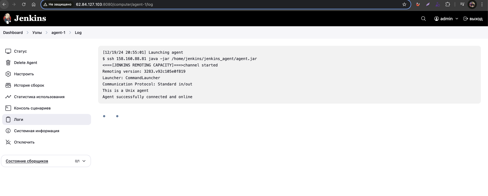
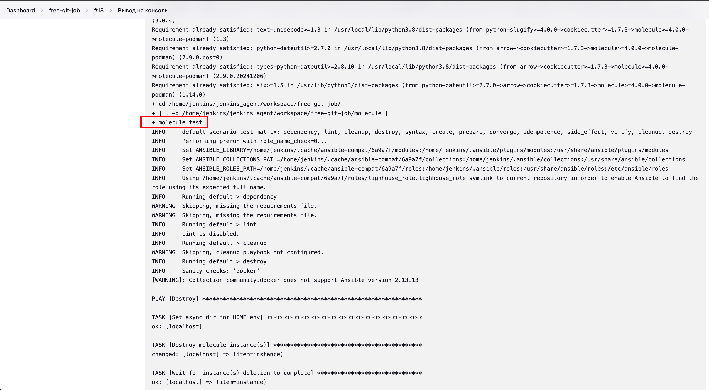
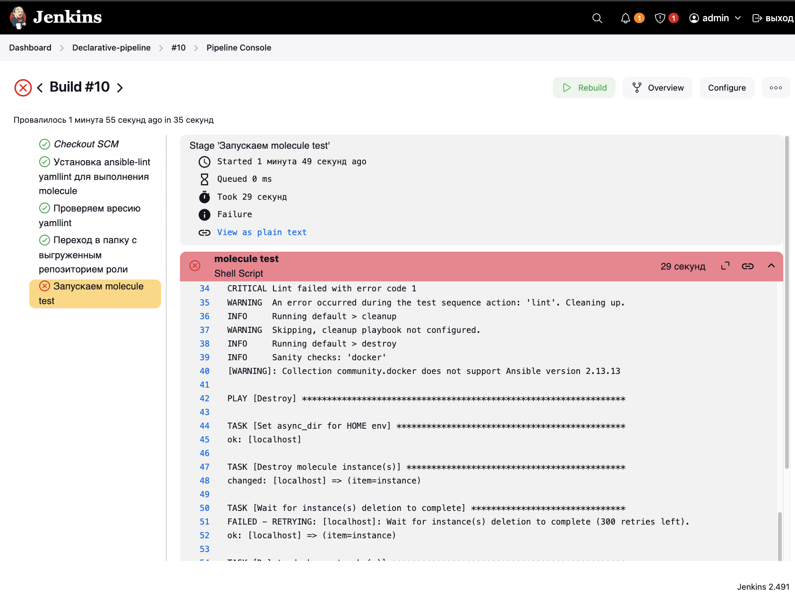
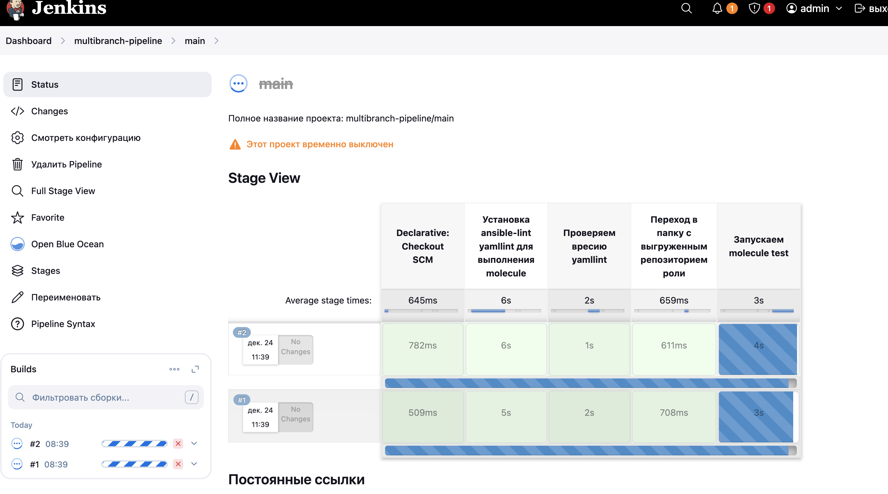
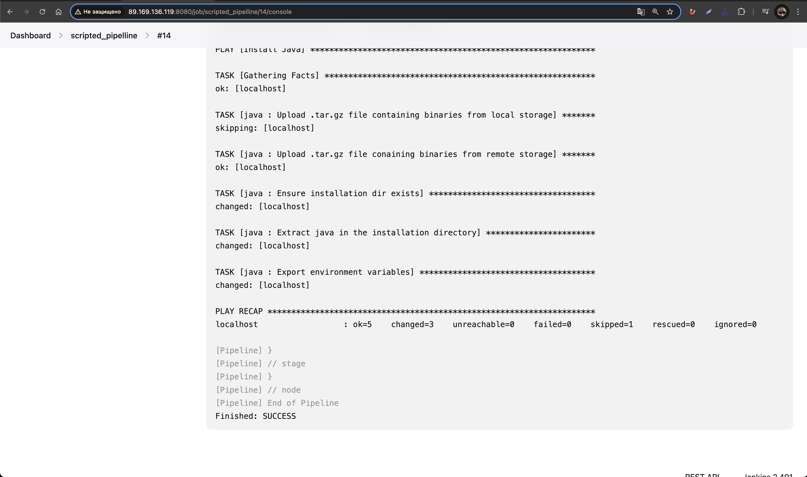
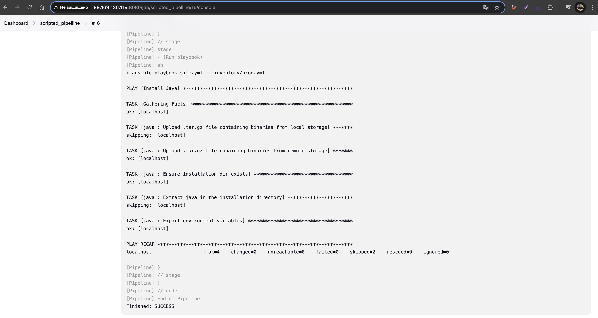

# Домашнее задание к занятию 10 «Jenkins»

## Подготовка к выполнению

**Создать два VM: для jenkins-master и jenkins-agent.**

```bash
cd terraform-vms-centos
terraform init
terraform apply
```

**Установить Jenkins при помощи playbook.**

Переписал playbook на ubunru: [ссылка на playbook](./infrastructure/ubuntu_jenkins.yml)

Запустить и проверить работоспособность.

Сделать первоначальную настройку.
- Добавил агент
- Добавил команду `ssh <agent_ip> java -jar /home/jenkins/jenkins_agent/agent.jar`



## Основная часть

1. Сделать Freestyle Job, который будет запускать `molecule test` из любого вашего репозитория с ролью.

2. Сделать Declarative Pipeline Job, который будет запускать `molecule test` из любого вашего репозитория с ролью.
3. Перенести Declarative Pipeline в репозиторий в файл `Jenkinsfile`.

https://github.com/Mkezhman85/lighthouse-role/blob/main/Jenkinsfile
4. Создать Multibranch Pipeline на запуск `Jenkinsfile` из репозитория.

5. Создать Scripted Pipeline, наполнить его скриптом из [pipeline](./pipeline).
На этом шаге при запуске pipeline при попытке клонировать код из репо ошибка `Warning: CredentialId "5ac0095d-0185-431b-94da-09a0ad9b0e2c" could not be found.`. В качестве обхожного решения с клонировал репозиторий по https.

Также при запуске playbook возникала ошибка `Permission denied`, которая требовала sudo при выполнении команды.

Временное решение:
- Подключиться по ssh к vm агента
- Запустить команду `sudo visudo`
- Добавить строку `jenkins ALL= NOPASSWD: ALL` и сохранить

Результат запуска pipeline:


6. Внести необходимые изменения, чтобы Pipeline запускал `ansible-playbook` без флагов `--check --diff`, 
    если не установлен параметр при запуске джобы (prod_run = True). 
    По умолчанию параметр имеет значение False и запускает прогон с флагами `--check --diff`.
    ```jenkins
    node("linux"){
    stage("Git checkout"){
        git branch: 'master',
            url: 'https://github.com/Mkezhman85/example-playbook.git'
    }
    stage("define env"){
        prod_run=false
    }
    stage("Run playbook"){
        if (prod_run){
            sh 'ansible-playbook site.yml -i inventory/prod.yml --check --diff'
        }
        else{
            sh 'ansible-playbook site.yml -i inventory/prod.yml'
        }

        }
    }
    ```
    
7. Проверить работоспособность, исправить ошибки, исправленный Pipeline вложить в репозиторий в файл `ScriptedJenkinsfile`.
8. Отправить ссылку на репозиторий с ролью и Declarative Pipeline и Scripted Pipeline.
 Declarative Pipeline: https://github.com/Mkezhman85/lighthouse-role/blob/main/Jenkinsfile
 Scripted Pipeline: [ScriptedJenkinsfile](./pipeline/ScriptedJenkinsfile)
9. Сопроводите процесс настройки скриншотами для каждого пункта задания!!

