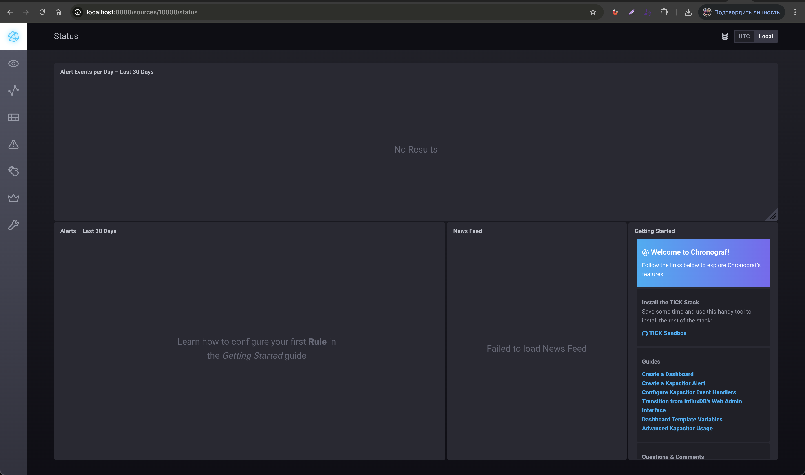
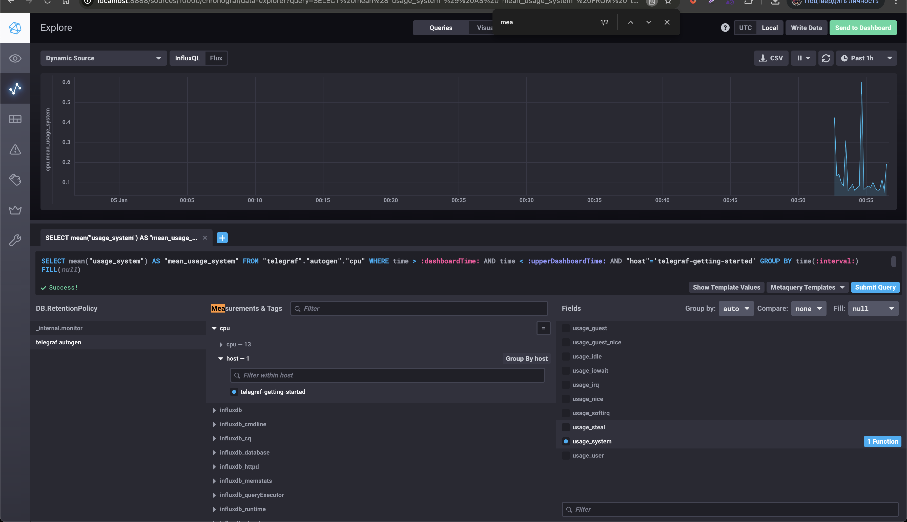
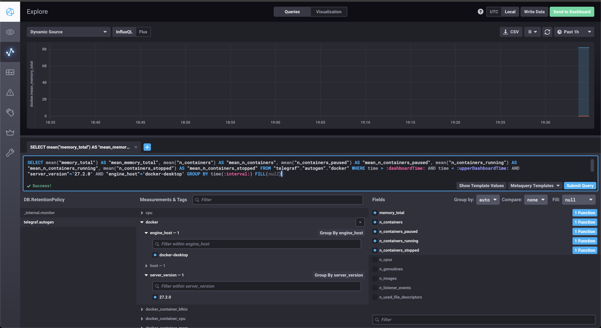

# Домашнее задание к занятию "13.Системы мониторинга"

## Обязательные задания

### 1. Вас пригласили настроить мониторинг на проект. На онбординге вам рассказали, что проект представляет из себя платформу для вычислений с выдачей текстовых отчетов, которые сохраняются на диск. Взаимодействие с платформой осуществляется по протоколу http. Также вам отметили, что вычисления загружают ЦПУ. Какой минимальный набор метрик вы выведите в мониторинг и почему?

- CPU Load Average - информация о нагрузке на центральный процессор. Если слишком высокая нагрузка, то необходимо масштабирование или рефакторинг приложения
- RAM/swap - информация об утечках памяти или переполнению конткеста приложения. Переполнение контекста приведет к потере работоспособности приложения и недоступности функционала
- IOPS - число операций с диском в секунду. Большие значения могут свидетельствовать о прблемах с дисками. Наличие проблем с дисками приведет к невозможности сохранения отчетов на дисках
- inodes - переполнение индексных дескрипторов. Если происходит переполнение, то сохранение отчетов на диск станет невозможным
- FS - мониторинг свободного места на диске. Если диск переполнен, то сохранение отчетов на диск не произойдет

### 2. Менеджер продукта посмотрев на ваши метрики сказал, что ему непонятно что такое RAM/inodes/CPUla. Также он сказал, что хочет понимать, насколько мы выполняем свои обязанности перед клиентами и какое качество обслуживания. Что вы можете ему предложить?

CPU Load Average - информация о нагрузке на центральный процессор. Если слишком высокая нагрузка, то необходимо масштабирование или рефакторинг приложения.

Предложение: использовать SRE, а именно использование метрик "4-х золотых сигналов":

- время отклика
- величина трафика. Количество HTTP запросов
- уровень ошибок. Например количество 500-х и 400-х ошибок HTTP сервера
- степень загруженности. Насколько полно загружен сервис

### 3. Вашей DevOps команде в этом году не выделили финансирование на построение системы сбора логов. Разработчики в свою очередь хотят видеть все ошибки, которые выдают их приложения. Какое решение вы можете предпринять в этой ситуации, чтобы разработчики получали ошибки приложения?

Развернуть следующие инструменты:

- sentry - для отлова ошибок
- использовать коробочное решение типа zabbix или tick для сбора метрик приложения

### 4. Вы, как опытный SRE, сделали мониторинг, куда вывели отображения выполнения SLA=99% по http кодам ответов. Вычисляете этот параметр по следующей формуле: summ_2xx_requests/summ_all_requests. Данный параметр не поднимается выше 70%, но при этом в вашей системе нет кодов ответа 5xx и 4xx. Где у вас ошибка?

sli = (summ_2xx_requests + summ_3xx_requests)/(summ_all_requests)

### 5. Опишите основные плюсы и минусы pull и push систем мониторинга.

#### Pull

Плюсы:

- Легче контролировать подлинность данных. Есть возмножность централизованно задавать список агентов, которых нужно опрашивать
- Можно настроить единый proxy server до всех агентов с TLS. Можно разнести систему мониторинга и агентов с гарантией безопасности их взаимодействия через прокси
- Упрощенная отладка получения данных с агентов. Для отладки можно самостоятельно запрашивать метрики с агентов, используя ПО вне системы мониторинга

#### Push
Плюсы:

- Упрощение репликации данных в разные системы мониторинга или их резервные копии
- Более гибкая настройка отправвки пакетов данных с метриками. Например объем данных и частоту отправки
- UDP - это менее затратный способ передачи данных, из-за чего может возрасти производительность сбора метрик

Минусы:

- Из-за использования UDP может пострадать гарантия доставки пакетов


### 6. Какие из ниже перечисленных систем относятся к push модели, а какие к pull? А может есть гибридные?

    - Prometheus - pull
    - TICK - push
    - Zabbix - гибридная
    - VictoriaMetrics - гибридная
    - Nagios - pull
#
7. Склонируйте себе [репозиторий](https://github.com/influxdata/sandbox/tree/master) и запустите TICK-стэк, 
используя технологии docker и docker-compose.

В виде решения на это упражнение приведите скриншот веб-интерфейса ПО chronograf (`http://localhost:8888`). 

P.S.: если при запуске некоторые контейнеры будут падать с ошибкой - проставьте им режим `Z`, например
`./data:/var/lib:Z`


#
8. Перейдите в веб-интерфейс Chronograf (http://localhost:8888) и откройте вкладку Data explorer.
        
    - Нажмите на кнопку Add a query
    - Изучите вывод интерфейса и выберите БД telegraf.autogen
    - В `measurments` выберите cpu->host->telegraf-getting-started, а в `fields` выберите usage_system. Внизу появится график утилизации cpu.
    - Вверху вы можете увидеть запрос, аналогичный SQL-синтаксису. Поэкспериментируйте с запросом, попробуйте изменить группировку и интервал наблюдений.

Для выполнения задания приведите скриншот с отображением метрик утилизации cpu из веб-интерфейса.

#
9. Изучите список [telegraf inputs](https://github.com/influxdata/telegraf/tree/master/plugins/inputs). 
Добавьте в конфигурацию telegraf следующий плагин - [docker](https://github.com/influxdata/telegraf/tree/master/plugins/inputs/docker):
```
[[inputs.docker]]
  endpoint = "unix:///var/run/docker.sock"
```

Дополнительно вам может потребоваться донастройка контейнера telegraf в `docker-compose.yml` дополнительного volume и 
режима privileged:
```
  telegraf:
    image: telegraf:1.4.0
    privileged: true
    volumes:
      - ./etc/telegraf.conf:/etc/telegraf/telegraf.conf:Z
      - /var/run/docker.sock:/var/run/docker.sock:Z
    links:
      - influxdb
    ports:
      - "8092:8092/udp"
      - "8094:8094"
      - "8125:8125/udp"
```

После настройке перезапустите telegraf, обновите веб интерфейс и приведите скриншотом список `measurments` в 
веб-интерфейсе базы telegraf.autogen . Там должны появиться метрики, связанные с docker.

