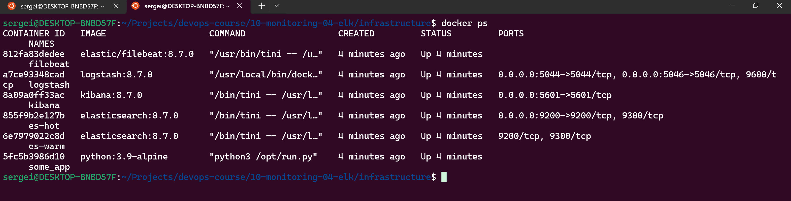
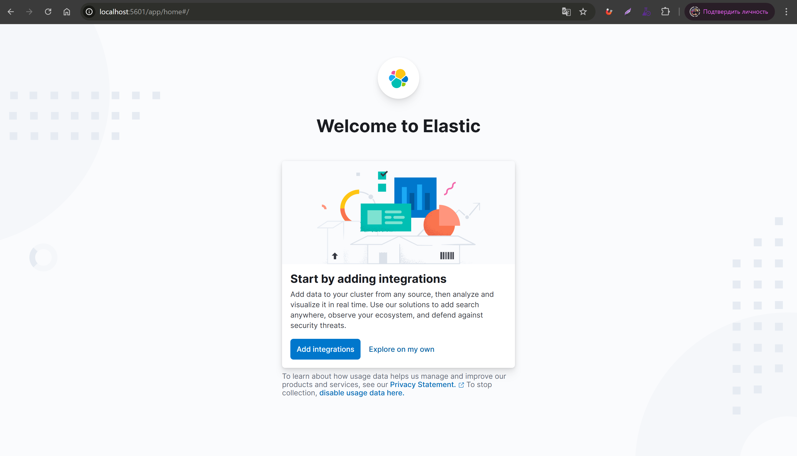
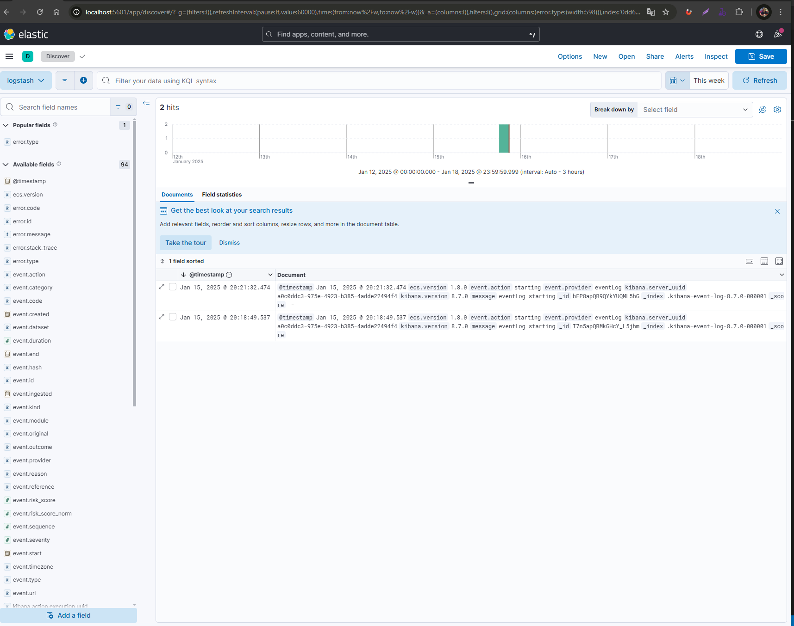
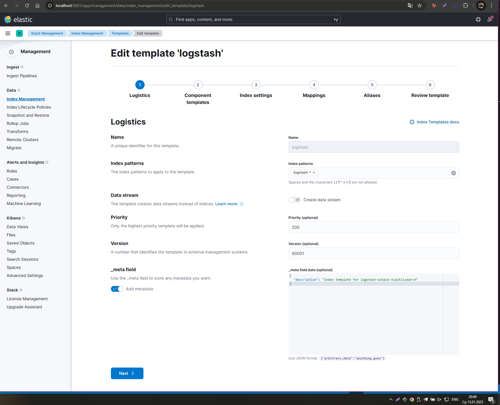
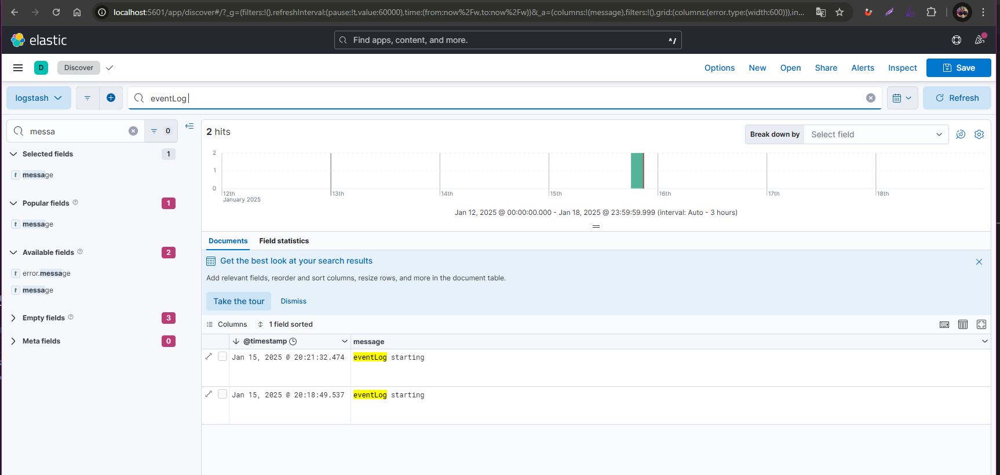

# Домашнее задание к занятию 15 «Система сбора логов Elastic Stack»

## Задание 1

Результат:

- скриншот `docker ps` через 5 минут после старта всех контейнеров (их должно быть 5);

- скриншот интерфейса kibana;

---

## Задание 2

Перейдите в меню [создания index-patterns  в kibana](http://localhost:5601/app/management/kibana/indexPatterns/create) и создайте несколько index-patterns из имеющихся.

Перейдите в меню просмотра логов в kibana (Discover) и самостоятельно изучите, как отображаются логи и как производить поиск по логам.

 