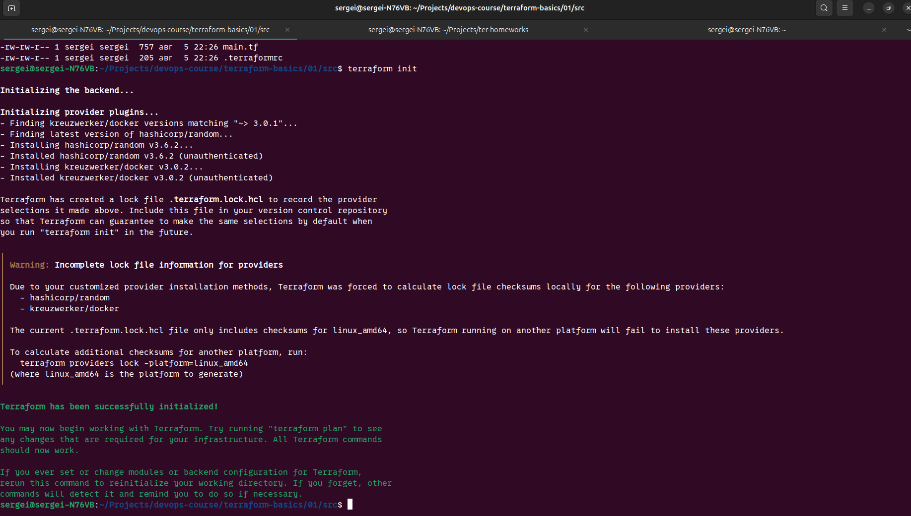
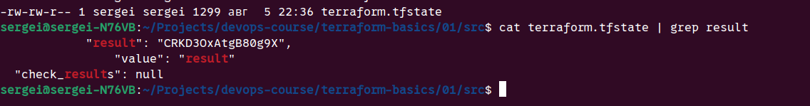
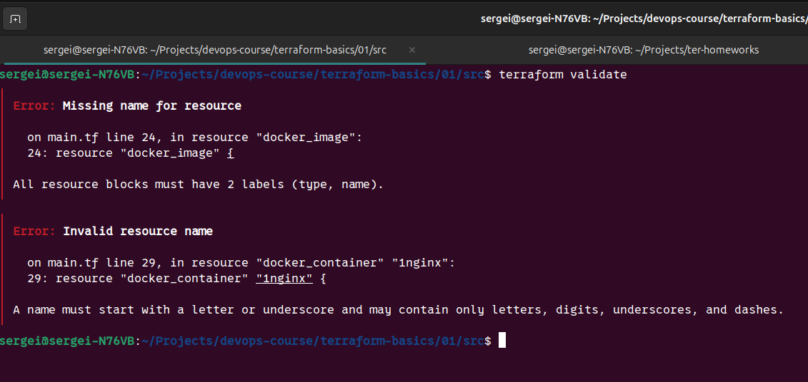
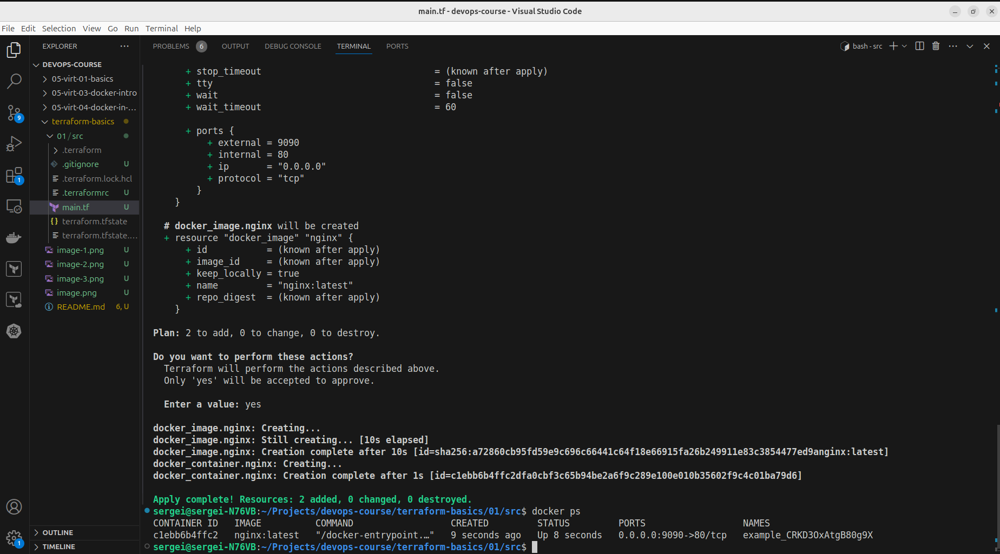
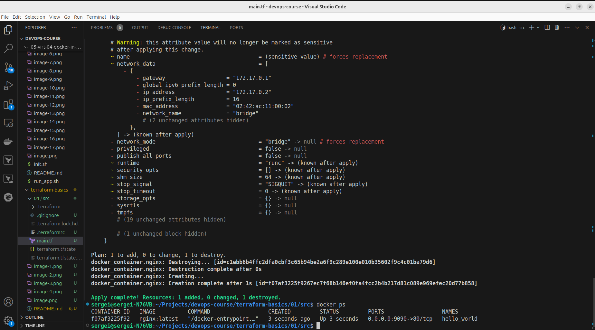
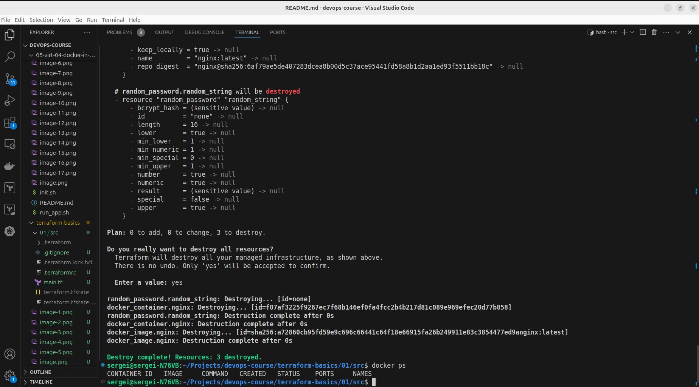
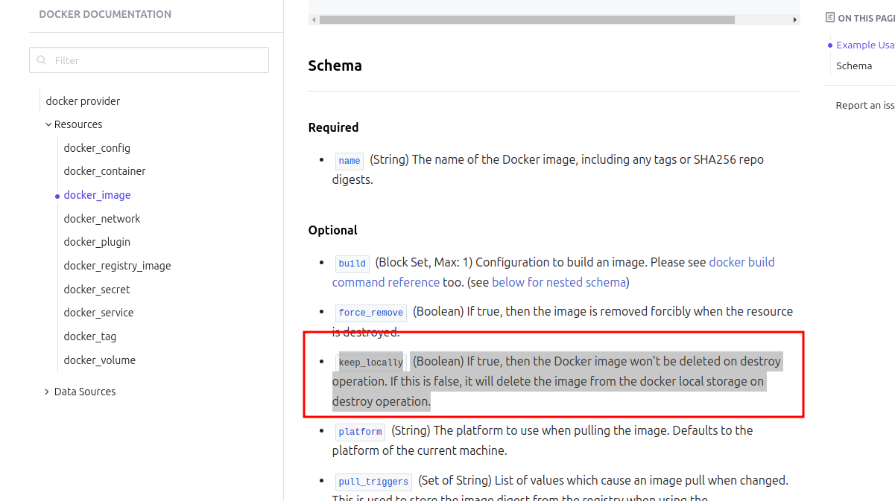
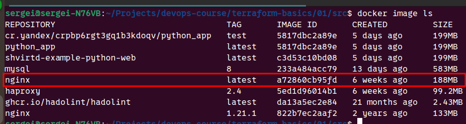

# Задание 1
- [x] Перейдите в каталог src. Скачайте все необходимые зависимости, использованные в проекте.

- [x] Изучите файл .gitignore. В каком terraform-файле, согласно этому .gitignore, допустимо сохранить личную, секретную информацию?(логины,пароли,ключи,токены итд)
`*.tfstate`
- [x] Выполните код проекта. Найдите в state-файле секретное содержимое созданного ресурса random_password, пришлите в качестве ответа конкретный ключ и его значение.
`"result": "CRKD3OxAtgB80g9X",`

- [x] Раскомментируйте блок кода, примерно расположенный на строчках 29–42 файла main.tf. Выполните команду terraform validate. Объясните, в чём заключаются намеренно допущенные ошибки. Исправьте их.

- [x] Выполните код. В качестве ответа приложите: исправленный фрагмент кода и вывод команды docker ps.

- [x] Замените имя docker-контейнера в блоке кода на hello_world. Не перепутайте имя контейнера и имя образа. Мы всё ещё продолжаем использовать name = "nginx:latest". Выполните команду terraform apply -auto-approve. Объясните своими словами, в чём может быть опасность применения ключа -auto-approve. Догадайтесь или нагуглите зачем может пригодиться данный ключ? В качестве ответа дополнительно приложите вывод команды docker ps.
> Перед выполнением мы можем посмотреть, какие изменения будут внесены. Если поставить это флаг, то изменения применятся сразу без подтверждения. Есть шанс что-то сделать не так

- [x] Уничтожьте созданные ресурсы с помощью terraform. Убедитесь, что все ресурсы удалены. Приложите содержимое файла terraform.tfstate.
```json
{
  "version": 4,
  "terraform_version": "1.8.4",
  "serial": 11,
  "lineage": "226389d2-7410-e5f5-d5db-692a58f81cc8",
  "outputs": {},
  "resources": [],
  "check_results": null
}
```

- [x] Объясните, почему при этом не был удалён docker-образ nginx:latest. Ответ ОБЯЗАТЕЛЬНО НАЙДИТЕ В ПРЕДОСТАВЛЕННОМ КОДЕ, а затем ОБЯЗАТЕЛЬНО ПОДКРЕПИТЕ строчкой из документации terraform провайдера docker. (ищите в классификаторе resource docker_image )
  
`keep_locally (Boolean) If true, then the Docker image won't be deleted on destroy operation. If this is false, it will delete the image from the docker local storage on destroy operation.`

