### Задание 1

- [x] Изучите проект.
- [x] Заполните файл personal.auto.tfvars.
- [x] Инициализируйте проект, выполните код. Он выполнится, даже если доступа к preview нет.
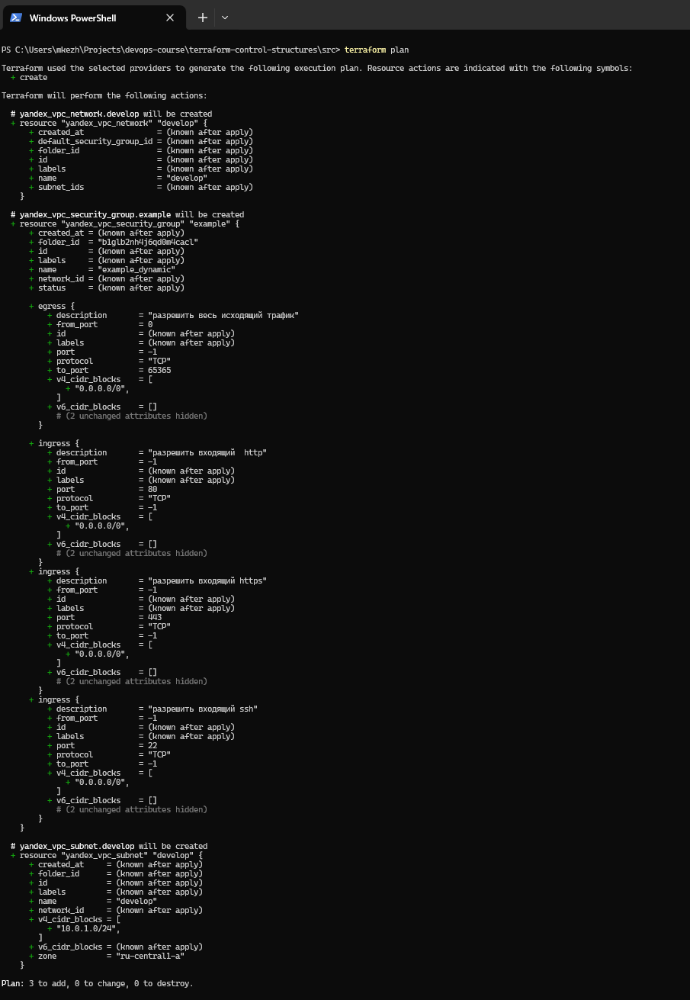
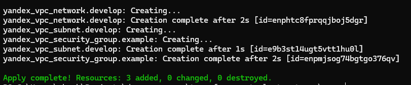
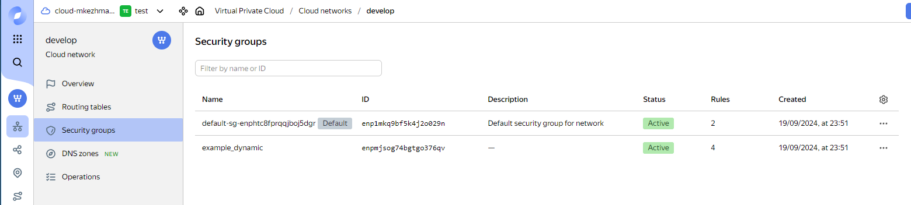
---

### Задание 2

- [x] Создайте файл count-vm.tf. Опишите в нём создание двух **одинаковых** ВМ  web-1 и web-2 (не web-0 и web-1) с минимальными параметрами, используя мета-аргумент **count loop**. Назначьте ВМ созданную в первом задании группу безопасности.(как это сделать узнайте в документации провайдера yandex/compute_instance )
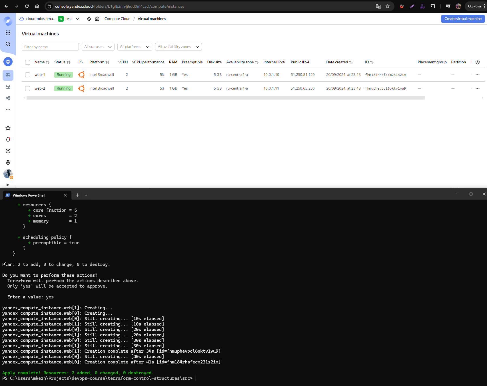
- [x] Создайте файл for_each-vm.tf. Опишите в нём создание двух ВМ для баз данных с именами "main" и "replica" **разных** по cpu/ram/disk_volume , используя мета-аргумент **for_each loop**. Используйте для обеих ВМ одну общую переменную типа:
```
variable "each_vm" {
  type = list(object({  vm_name=string, cpu=number, ram=number, disk_volume=number }))
}
```  
При желании внесите в переменную все возможные параметры.
- [x] ВМ из пункта 2.1 должны создаваться после создания ВМ из пункта 2.2.
- [x] Используйте функцию file в local-переменной для считывания ключа ~/.ssh/id_rsa.pub и его последующего использования в блоке metadata, взятому из ДЗ 2.
- [x] Инициализируйте проект, выполните код.
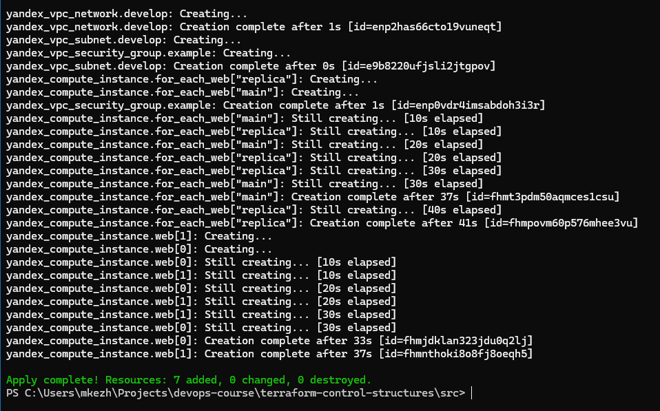
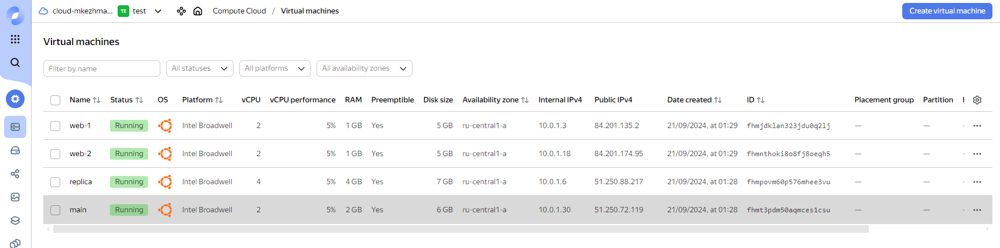
---

### Задание 3

- [x] Создайте 3 одинаковых виртуальных диска размером 1 Гб с помощью ресурса yandex_compute_disk и мета-аргумента count в файле **disk_vm.tf** .
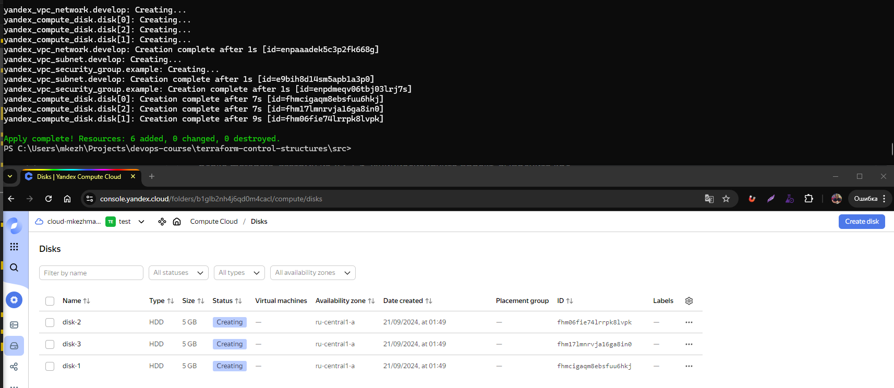
- [x] Создайте в том же файле **одиночную**(использовать count или for_each запрещено из-за задания №4) ВМ c именем "storage"  . Используйте блок **dynamic secondary_disk{..}** и мета-аргумент for_each для подключения созданных вами дополнительных дисков.
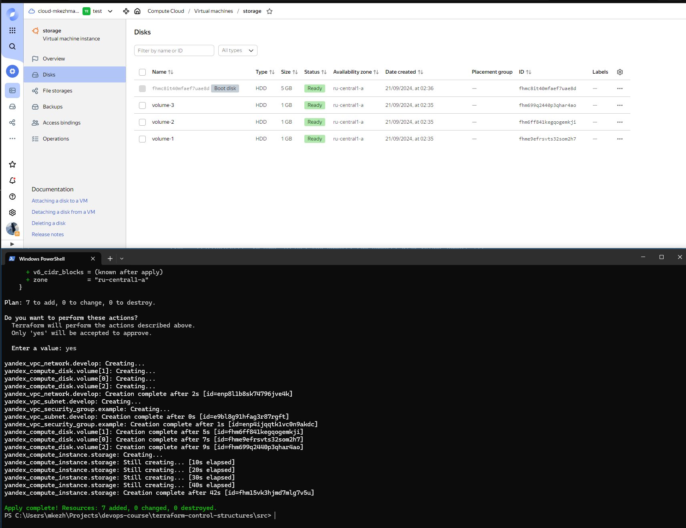
---


### Задание 4

- [x] В файле ansible.tf создайте inventory-файл для ansible.
Используйте функцию tepmplatefile и файл-шаблон для создания ansible inventory-файла из лекции.
Готовый код возьмите из демонстрации к лекции [**demonstration2**](https://github.com/netology-code/ter-homeworks/tree/main/03/demo).
Передайте в него в качестве переменных группы виртуальных машин из задания 2.1, 2.2 и 3.2, т. е. 5 ВМ.
- [x] Инвентарь должен содержать 3 группы и быть динамическим, т. е. обработать как группу из 2-х ВМ, так и 999 ВМ.
- [x] Добавьте в инвентарь переменную  [**fqdn**](https://cloud.yandex.ru/docs/compute/concepts/network#hostname).
``` 
[webservers]
web-1 ansible_host=<внешний ip-адрес> fqdn=<полное доменное имя виртуальной машины>
web-2 ansible_host=<внешний ip-адрес> fqdn=<полное доменное имя виртуальной машины>

[databases]
main ansible_host=<внешний ip-адрес> fqdn=<полное доменное имя виртуальной машины>
replica ansible_host<внешний ip-адрес> fqdn=<полное доменное имя виртуальной машины>

[storage]
storage ansible_host=<внешний ip-адрес> fqdn=<полное доменное имя виртуальной машины>
```
Пример fqdn: ```web1.ru-central1.internal```(в случае указания переменной hostname(не путать с переменной name)); ```fhm8k1oojmm5lie8i22a.auto.internal```(в случае отсутвия перменной hostname - автоматическая генерация имени,  зона изменяется на auto). нужную вам переменную найдите в документации провайдера или terraform console.
- [x] Выполните код. Приложите скриншот получившегося файла. 
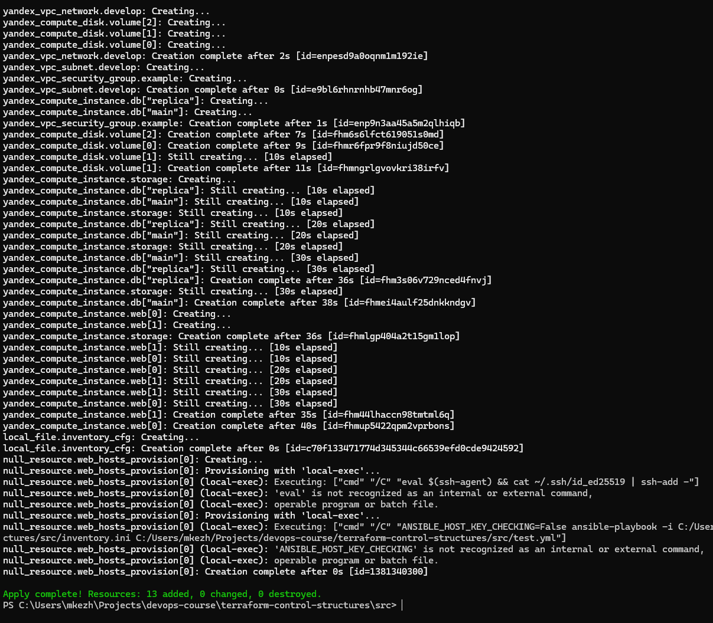
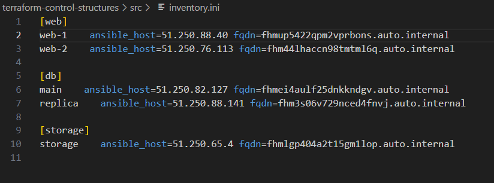
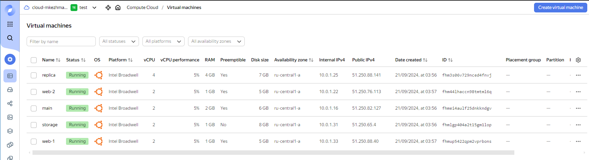
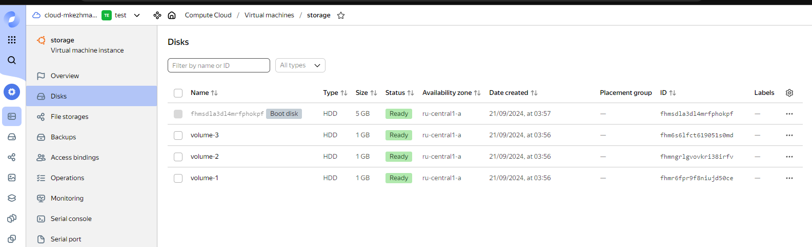
Для общего зачёта создайте в вашем GitHub-репозитории новую ветку terraform-03. Закоммитьте в эту ветку свой финальный код проекта, пришлите ссылку на коммит.   
**Удалите все созданные ресурсы**.